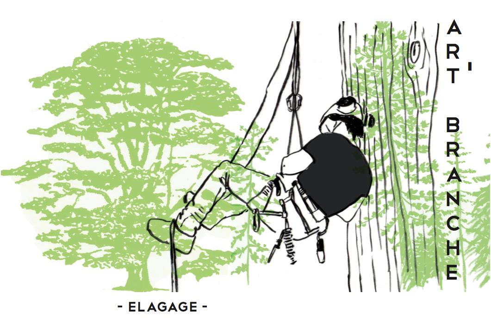

Entreprise Art'Branche Élagage
==============================

Bienvenue sur le site de l'entreprise Art'Branche Élagage, dirigée par Clément
LEBRUN-GRANDIÉ, spécialiste des travaux d'élagage et d'abattage d'arbres sur
les départements de la Dordogne et de la Gironde.

Présentation
------------
Clément LEBRUN-GRANDIÉ, arboriste grimpeur élagueur depuis 2011, diplômé du
centre de formation de Nérac dans le Lot-et-Garonne (47).

"Amoureux des arbres et de l'escalade, j'exerce mon métier avec passion,
dans le respect de l'environnement et des règles de sécurité."

.. _services:

Services et prestations
-----------------------
* Conseils et diagnostic
* Taille raisonnée des arbres
* Soins arboricoles
* Intervention sur les grands arbres et arbres dangereux
* Abattage des arbres par démontage

.. _secteurs:

Secteurs d'intervention
-----------------------
Située sur l'agglomération de Périgueux en Dordogne (Périgord blanc - 24),
l'entreprise Art'Branche Élagage intervient en Dordogne et en Gironde (33)
sur les secteur de Bordeaux et Libourne.

.. _contact:

Mes coordonnées
--------------

+---------+------------------------------+
| Adresse | | 3, avenue de la Résistance |
|         | | 24750 Boulazac             |
+---------+------------------------------+
| Tél     | 06 12 12 92 74               |
+---------+------------------------------+
| Mail    | artbranche@gmail.com         |
+---------+------------------------------+
| Siret   | 800 075 772                  |
+---------+------------------------------+
